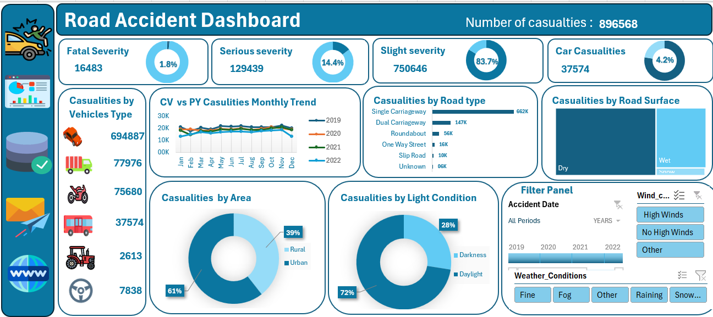
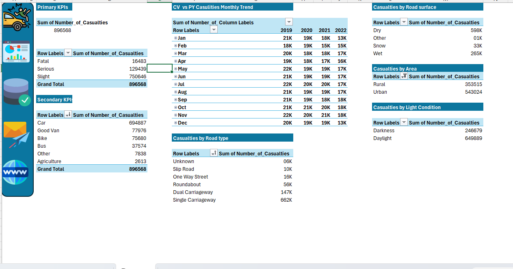

# 🚗 Road Accident Analysis Dashboard

## 📊 Project Overview

The Road Accident Analysis Dashboard is an interactive Microsoft Excel dashboard designed to analyze accident casualty data and uncover trends related to accident severity, vehicle types, road conditions, road types, area categories, and environmental factors.

The dashboard transforms raw accident data into meaningful business insights through interactive visualizations, KPI cards, charts, and slicers, enabling data-driven decision-making for road safety analysis.

---

## 📌 Project Type

**Data Analysis Project | Excel Dashboard | Portfolio Project**

---

## 🎯 Project Objectives

* Analyze overall road accident casualties.
* Track fatal, serious, and slight casualties.
* Compare casualty trends across multiple years.
* Identify vehicle types involved in accidents.
* Analyze accident distribution by road type.
* Evaluate road surface conditions affecting accidents.
* Compare urban and rural casualty trends.
* Analyze accidents by light conditions.
* Build an interactive dashboard using Excel.

---

## ⭐ Key Highlights

* Built an interactive dashboard using Microsoft Excel.
* Created KPI Cards for casualty analysis.
* Developed Year-over-Year casualty trend analysis.
* Performed vehicle-wise casualty analysis.
* Implemented road type and road surface condition reporting.
* Used Pivot Tables, Pivot Charts, and Slicers for dynamic analysis.
* Designed a professional dashboard layout with interactive filters.

---

## 🛠️ Tools & Technologies Used

* Microsoft Excel
* Pivot Tables
* Pivot Charts
* Slicers
* Donut Charts
* Line Charts
* Treemap Charts
* Bar Charts
* Conditional Formatting
* Data Visualization

---

## 📈 Key Performance Indicators (KPIs)

| KPI                | Value   |
| ------------------ | ------- |
| Total Casualties   | 896,568 |
| Fatal Casualties   | 16,483  |
| Serious Casualties | 129,439 |
| Slight Casualties  | 750,646 |
| Car Casualties     | 37,574  |

---

## 📊 Dashboard Features

### Casualty Severity Analysis

* Fatal Casualties
* Serious Casualties
* Slight Casualties

### Vehicle Type Analysis

* Cars
* Vans
* Bikes
* Buses
* Agricultural Vehicles
* Other Vehicles

### Casualty Trend Analysis

* Current Year vs Previous Year Comparison
* Month-wise Casualty Trends
* Multi-Year Trend Analysis

### Road Type Analysis

* Single Carriageway
* Dual Carriageway
* Roundabout
* One Way Street
* Slip Road
* Unknown

### Road Surface Analysis

* Dry Roads
* Wet Roads
* Snow Roads

### Area Analysis

* Urban Casualties
* Rural Casualties

### Light Condition Analysis

* Daylight
* Darkness

### Interactive Filters

* Accident Date
* Weather Conditions
* Wind Conditions

---

## 📸 Dashboard Preview

### Road Accident Dashboard



### Pivot Table Analysis



---

## 🔍 Key Insights

* Slight casualties account for the majority of total casualties.
* Single carriageways contribute the highest number of casualties.
* Most accidents occur during daylight conditions.
* Urban areas experience more casualties than rural areas.
* Dry road surfaces account for the highest accident frequency.
* Cars are involved in the majority of accident casualties.

---

## 💡 Skills Demonstrated

* Data Cleaning
* Data Transformation
* Dashboard Development
* KPI Design
* Data Visualization
* Business Intelligence Reporting
* Excel Reporting
* Trend Analysis
* Interactive Dashboard Design

---
### Road-Accident-Analysis-Dashboard/
```text
├── README.md
├── Road_Accident_Dashboard_Documentation.docx
├── Dashboard_Overview.png
└── Pivot_Tables.png
```


---

## 📂 Project Files

This repository includes:

- Dashboard Screenshot
- Pivot Table Analysis Screenshot
- Project Documentation
- Project README

**Note:** The original Excel workbook and dataset are not included due to file size limitations.

---

## 🚀 Project Outcome

Successfully developed an interactive Road Accident Analysis Dashboard that provides a comprehensive view of casualty trends, accident severity, road conditions, and vehicle involvement.

---

## 👩‍💻 Author

**Deepali Sharma**

Aspiring Data Analyst | MIS Analyst

### Connect With Me

* LinkedIn: https://www.linkedin.com/in/deepali-sharma-689731340/
* GitHub: https://github.com/sharmadeepali413-cpu

---

⭐ If you found this project useful, consider giving it a star on GitHub.

